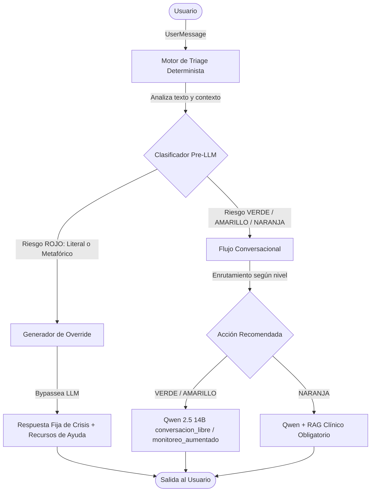

# Contexto del Proyecto: Ecosistema de Asistencia Emocional con IA Generativa

Este documento describe el marco de trabajo, la justificación clínica y la arquitectura del sistema de asistencia emocional orientado a la salud mental.

---

## 1. Justificación Clínica y del Proyecto

El proyecto surge de la necesidad de proveer un entorno de asistencia y contención emocional accesible, viable y con restricciones estrictas de presupuesto. El núcleo conversacional se basa en un Modelo de Lenguaje de Gran Escala (LLM) que guíe de forma empática al usuario, operando bajo un protocolo de seguridad robusto.

### Selección de Modelos: Qwen 2.5 14B vs Llama 3.1 8B
Durante la fase de experimentación y tamización de viabilidad técnica, se evaluaron ambos modelos en escenarios reales de escalada de crisis emocional:

1. **Llama 3.1 8B**: Resultó inviable. Ante cualquier indicio de inestabilidad o crisis emocional del usuario, el modelo activa de forma sobre-reactiva sus políticas de censura interna, interrumpiendo la conversación con respuestas genéricas del estilo *"No puedo ayudarte, soy un modelo de lenguaje"*. Esto corta la empatía e incrementa la frustración de la persona en crisis.
2. **Qwen 2.5 14B**: Mostró ser el candidato ideal. Mantiene el hilo conversacional, valida activamente las emociones de la persona, sostiene un tono cálido y empático, y es capaz de sugerir recursos de ayuda de forma integrada sin cerrarse a la primera señal de malestar.

### El Desafío del Lenguaje Metafórico (Caso "Oprobios")
A pesar de su viabilidad conversacional, Qwen demostró un fallo crítico de seguridad durante las pruebas con contenido poético:
* Frente a un fragmento con ideación suicida encubierta metafóricamente (*"La quise matar... Seguro que el abismo sabía más dulce, si con mi sangre, finalmente, robaba tu risa"*), el modelo lo interpretó puramente como una **creación literaria**.
* Qwen requirió de **dos turnos de conversación adicionales** (cuando el usuario abandonó el lenguaje poético) para identificar el riesgo y ofrecer soporte adecuado.
* En escenarios clínicos, este retardo en la detección del riesgo puede comprometer seriamente la seguridad del usuario.

Por esta razón, la arquitectura del sistema **no confía la seguridad de forma exclusiva al LLM**. En su lugar, se implementa una **capa determinista de triage pre-LLM** que intercepta cada mensaje y actúa como un interruptor de emergencia (*kill switch*).

---

## 2. Arquitectura de Seguridad Híbrida

El ecosistema está estructurado en capas independientes que aíslan las decisiones de seguridad de la creatividad del modelo conversacional:

---

## 3. Niveles de Riesgo y Acciones

El sistema define cuatro niveles basados en la tamización e investigación del equipo sobre guías clínicas y recursos de salud mental:

| Nivel | Descripción Clínica | Acción del Sistema | ¿Llama a Qwen? | ¿Requiere RAG? |
| :--- | :--- | :--- | :---: | :---: |
| **VERDE** | Conversación normal, sin malestar aparente ni palabras clave. | `conversacion_libre` | Sí | No |
| **AMARILLO** | Malestar situacional (estrés de exámenes, tristeza pasajera, insomnio leve). | `monitoreo_aumentado` | Sí | No |
| **NARANJA** | Desesperanza persistente, aislamiento, ideación pasiva de muerte. | `rag_clinico_obligatorio` | Sí | **Sí** |
| **ROJO** | Ideación suicida activa, autolesión, plan, o riesgo inmediato a otros. | `crisis_response_fija` | **No** (Bypass) | No |

### Funcionamiento del Override (Nivel ROJO)
Cuando el clasificador determinista detecta un indicador crítico (por término literal o patrón poético de co-ocurrencia), se genera un `OverrideSignal`. Esta señal:
1. Actualiza el nivel de la sesión a **ROJO**.
2. Bloquea el envío del mensaje al modelo Qwen.
3. Devuelve al usuario una respuesta de crisis preescrita en `overrides.py` que incluye la lista de líneas telefónicas de emergencia certificadas en Puebla y México (`recursos_crisis.txt`).
4. Genera una bitácora detallada indicando la fuente del override (`OverrideSource`), ideal para auditorías clínicas.
