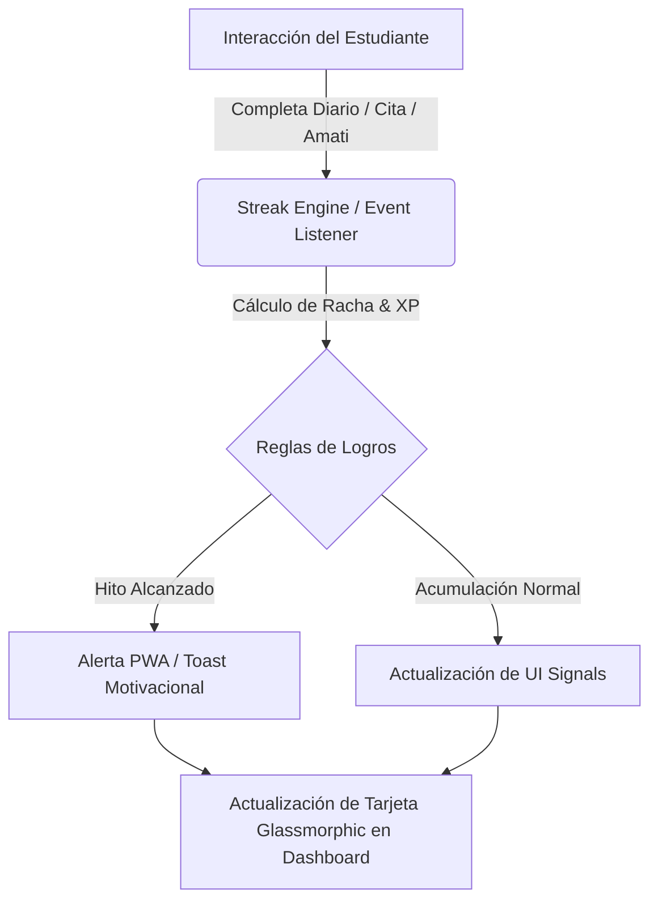
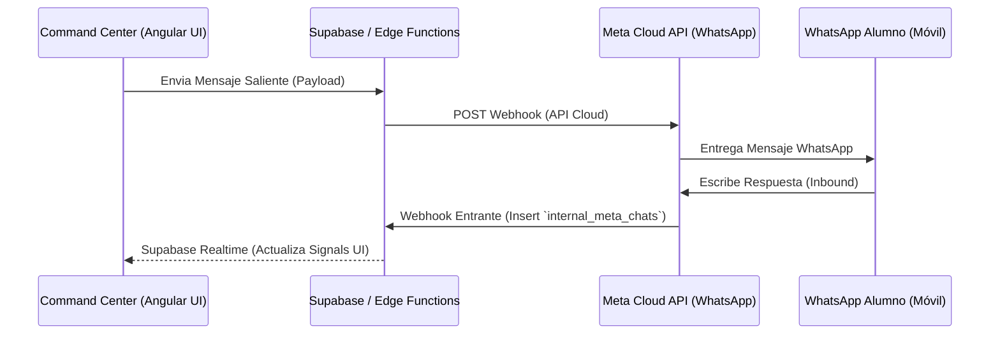

# Especificación de Experiencia de Usuario (UX/UI) e Interfaces en Angular 18+
**Alineación Arquitectónica con Metodología Spect / Spec-Driven Development (SDD)**

---

## 1. Filosofía de Diseño y Sistema Visual (Design System & Aesthetics)

El diseño de las nuevas interfaces del ecosistema se cimenta en una arquitectura visual de primer nivel que combina la robustez de **Angular Material 18+ (Material 3 - M3)** con la pulcritud estética del **Glassmorphism**. Este enfoque garantiza no solo el cumplimiento estricto de las normativas de usabilidad y accesibilidad clínica, sino también una experiencia inmersiva, moderna y emocionalmente segura para estudiantes y profesionales de la salud.

### 1.1. Principios Visuales y Tokens de Diseño
*   **Estética Glassmorphism:** Implementación de paneles translúcidos mediante `backdrop-filter: blur(16px)`, fondos con gradientes sutiles (`linear-gradient(135deg, rgba(255,255,255,0.85) 0%, rgba(248,250,252,0.95) 100%)` para temas claros y variaciones en tonos pizarra para modo oscuro), bordes semitransparentes (`border: 1px solid rgba(255, 255, 255, 0.6)`) y sombras con elevación suave (`box-shadow: 0 20px 50px rgba(15, 23, 42, 0.2)`).
*   **Sistema Tipográfico:** Uso de la fuente **Inter** (y fallback a Roboto/system-ui) con jerarquía clara basada en escalas M3 (`display`, `headline`, `title`, `body`, `label`).
*   **Paleta de Color Funcional e Institucional:**
    *   `Primary (BUAP / Clínico)`: `#003b5c` (Azul Institucional) y `#8b5cf6` (Violeta vibrante para gamificación e IA).
    *   `Secondary / Operativo`: `#3b82f6` (Azul interactivo) y `#10b981` (Verde esmeralda para Meta/WhatsApp).
    *   `Alertas / Triage`: `#ef4444` (Rojo urgencia/fuego), `#f59e0b` (Ámbar reubicación/bloqueo), `#16a34a` (Verde cumplimiento NOM-024/HIPAA).
*   **Arquitectura Angular Standalone & Signals:** Todos los componentes se estructuran como `standalone: true`, optimizados con `ChangeDetectionStrategy.OnPush` y gestionados reactivamente a través de **Signals** (`signal`, `computed`, `effect`) para un rendimiento sin reflojos (zone-less ready).

---

## 2. Especificación UX/UI 1: Sistema de Logros y Gamificación (Estilo Duolingo)
**Correspondencia SDD: `Skill 10` en `spec.md`**

### 2.1. Objetivo UX y Mecánicas Estilo Duolingo
El objetivo es construir un ciclo ético de recompensa (Dopamine Loop) que impulse la constancia del estudiante en el registro de su diario emocional, el cumplimiento del plan NutriMind y las sesiones de bienestar con Amati IA.



### 2.2. Arquitectura de Interfaces y Maquetación

#### A. Motor de Rachas (*Streak Engine*) & Top Navbar Widget
*   **Ubicación:** Integrado de forma fija en el Navbar superior (`DashboardLayoutComponent`).
*   **UI/UX:** Un componente visual compacto `app-streak-badge`. Muestra un icono de llama/fuego animado (`🔥`) con efectos de pulso en CSS al registrar la actividad del día. Al hacer clic, despliega un mini-calendario emergente (popover) mostrando los días consecutivos activos y el próximo hito.

#### B. XP Progress Bar & Nivel
*   **Ubicación:** Cabecera del panel de logros y resumen del dashboard estudiantil.
*   **UI/UX:** Barra de progreso estilizada (`mat-progress-bar` customizada con gradiente violeta/dorado) que muestra el nivel actual (ej. `Nivel 5: Explorador Emocional`), los XP actuales y los faltantes para el siguiente rango.

#### C. Centro de Logros (*Achievements Dashboard*)
*   **Ruta:** `/dashboard/achievements`
*   **Layout:** Malla responsiva (CSS Grid, `grid-template-columns: repeat(auto-fill, minmax(300px, 1fr))`).
*   **Anatomía de la Tarjeta de Logro (`app-achievement-card`):**
    *   *Estado Bloqueado:* Fondo Glassmorphism translúcido con opacidad del 60%, icono en escala de grises o con candado superpuesto, título sobrio y barra de progreso parcial (ej. `Registro de emociones: 3/7 días`).
    *   *Estado Desbloqueado:* Borde radiante vibrante (`#8b5cf6`), medalla a todo color con micro-animación al pasar el cursor (hover scale `1.03`), título destacado y sello de fecha de desbloqueo (`Desbloqueado el 15 Oct, 2026`).

```
+-------------------------------------------------------------+
| [🔥 15 Días]   [🌟 Nivel 5: 1200/2000 XP]    ( Foto Avatar )|
+-------------------------------------------------------------+
| ==================== MIS LOGROS =========================== |
|                                                             |
|  +-----------------------+     +-----------------------+    |
|  | (*) Racha de 7 Días   |     | (🔒) Asistencia Plena  |    |
|  |  ¡Completaste tu      |     |  Asiste a 5 citas     |    |
|  |  primera semana!      |     |  [=====>        ] 2/5 |    |
|  |  Desbloqueado: 12 Oct |     |                       |    |
|  +-----------------------+     +-----------------------+    |
+-------------------------------------------------------------+
```

#### D. Interfaz de Inyección de Logros Clínicos (Command Center)
*   **Usuario:** Psicólogos y Nutriólogos (`Personal de la Salud`).
*   **UI/UX:** Dentro del Visor Clínico Integral del paciente (`PatientProfileComponent`), se incorpora una pestaña/sección "🏆 Asignar Meta / Logro Clínico". Permite al especialista seleccionar logros predefinidos (ej. `Meta de hidratación de 2 litros`, `Diario de ansiedad superado`) o redactar un logro personalizado con recompensa de XP.

### 2.3. Especificación de Estructura Angular (Código Base Standalone)

```typescript
// src/app/features/gamification/models/achievement.model.ts
export interface Achievement {
  id: string;
  title: string;
  description: string;
  category: 'diary' | 'nutrition' | 'amati' | 'clinical' | 'global';
  xp_reward: number;
  icon_url: string;
  is_unlocked: boolean;
  unlocked_at?: Date | null;
  progress_current: number;
  progress_target: number;
  assigned_by_professional_id?: string | null;
}
```

```typescript
// src/app/features/gamification/achievements-dashboard/achievements-dashboard.component.ts
import { Component, OnInit, inject, signal, computed, ChangeDetectionStrategy } from '@angular/core';
import { CommonModule } from '@angular/common';
import { MatIconModule } from '@angular/material/icon';
import { MatProgressBarModule } from '@angular/material/progress-bar';
import { SupabaseService } from '../../../core/services/supabase.service';
import { AuthService } from '../../../core/services/auth.service';
import { Achievement } from '../models/achievement.model';

@Component({
  selector: 'app-achievements-dashboard',
  standalone: true,
  imports: [CommonModule, MatIconModule, MatProgressBarModule],
  changeDetection: ChangeDetectionStrategy.OnPush,
  template: `
    <div class="achievements-layout">
      <!-- Cabecera de Experiencia y Racha -->
      <div class="header-banner glass-card">
        <div class="streak-section">
          <div class="streak-icon-wrapper pulse-flame">🔥</div>
          <div class="streak-info">
            <h2>{{ streakDays() }} Días de Racha</h2>
            <span class="subtitle">Mantenla activa registrando en tu diario hoy</span>
          </div>
        </div>
        <div class="xp-section">
          <div class="xp-info">
            <span class="level-title">Nivel {{ currentLevel() }}: Experto en Bienestar</span>
            <span class="xp-count">{{ currentXp() }} / {{ nextLevelXp() }} XP</span>
          </div>
          <mat-progress-bar mode="determinate" [value]="xpProgress()"></mat-progress-bar>
        </div>
      </div>

      <!-- Grid de Logros -->
      <div class="achievements-grid">
        <div *ngFor="let item of achievements()" 
             class="achievement-card glass-card" 
             [class.unlocked]="item.is_unlocked">
          <div class="card-icon">
            
            <mat-icon *ngIf="!item.is_unlocked">lock</mat-icon>
          </div>
          <div class="card-content">
            <h3 class="title">{{ item.title }}</h3>
            <p class="description">{{ item.description }}</p>
            
            <div class="progress-area" *ngIf="!item.is_unlocked">
              <div class="progress-bar-bg">
                <div class="progress-bar-fill" [style.width.%]="(item.progress_current / item.progress_target) * 100"></div>
              </div>
              <span class="progress-text">{{ item.progress_current }} / {{ item.progress_target }}</span>
            </div>

            <div class="unlock-stamp" *ngIf="item.is_unlocked">
              <mat-icon>check_circle</mat-icon>
              <span>¡Completado el {{ item.unlocked_at | date:'dd MMM yyyy' }}! (+{{ item.xp_reward }} XP)</span>
            </div>
          </div>
        </div>
      </div>
    </div>
  `,
  styleUrls: ['./achievements-dashboard.component.scss']
})
export class AchievementsDashboardComponent implements OnInit {
  supabase = inject(SupabaseService).supabase;
  authService = inject(AuthService);

  achievements = signal<Achievement[]>([]);
  streakDays = signal<number>(0);
  currentXp = signal<number>(0);

  currentLevel = computed(() => Math.floor(this.currentXp() / 500) + 1);
  nextLevelXp = computed(() => this.currentLevel() * 500);
  xpProgress = computed(() => ((this.currentXp() % 500) / 500) * 100);

  async ngOnInit() {
    const userId = this.authService.currentUser()?.id;
    if (!userId) return;

    // Obtener datos del perfil para Racha y XP
    const { data: profile } = await this.supabase
      .from('profiles')
      .select('streak_days, total_xp')
      .eq('id', userId)
      .single();

    if (profile) {
      this.streakDays.set(profile.streak_days || 0);
      this.currentXp.set(profile.total_xp || 0);
    }

    // Obtener logros y su estado
    const { data: userAchievements } = await this.supabase
      .from('user_achievements')
      .select('*, achievement:achievements(*)')
      .eq('user_id', userId);

    if (userAchievements) {
      const formatted: Achievement[] = userAchievements.map((ua: any) => ({
        id: ua.achievement.id,
        title: ua.achievement.title,
        description: ua.achievement.description,
        category: ua.achievement.category,
        xp_reward: ua.achievement.xp_reward,
        icon_url: ua.achievement.icon_url || '/assets/icons/medal-default.svg',
        is_unlocked: ua.is_unlocked,
        unlocked_at: ua.unlocked_at ? new Date(ua.unlocked_at) : null,
        progress_current: ua.progress_current,
        progress_target: ua.achievement.progress_target,
        assigned_by_professional_id: ua.assigned_by_professional_id
      }));
      this.achievements.set(formatted);
    }
  }
}
```

```scss
// src/app/features/gamification/achievements-dashboard/achievements-dashboard.component.scss
.achievements-layout {
  display: flex;
  flex-direction: column;
  gap: 24px;
  padding: 24px;
  max-width: 1280px;
  margin: 0 auto;
  font-family: 'Inter', system-ui, sans-serif;
}

.glass-card {
  background: rgba(255, 255, 255, 0.65);
  backdrop-filter: blur(16px);
  -webkit-backdrop-filter: blur(16px);
  border: 1px solid rgba(255, 255, 255, 0.8);
  border-radius: 20px;
  box-shadow: 0 10px 30px rgba(15, 23, 42, 0.08);
}

.header-banner {
  display: flex;
  flex-wrap: wrap;
  justify-content: space-between;
  align-items: center;
  padding: 24px 32px;
  gap: 24px;
  border-left: 6px solid #8b5cf6;

  .streak-section {
    display: flex;
    align-items: center;
    gap: 20px;

    .streak-icon-wrapper {
      font-size: 2.5rem;
      width: 64px;
      height: 64px;
      display: flex;
      align-items: center;
      justify-content: center;
      background: linear-gradient(135deg, #fffbeb 0%, #fef3c7 100%);
      border-radius: 18px;
      box-shadow: 0 8px 16px rgba(245, 158, 11, 0.2);
      border: 1px solid #fde68a;
      
      &.pulse-flame {
        animation: flamePulse 2s infinite;
      }
    }

    .streak-info h2 {
      margin: 0;
      font-size: 1.6rem;
      font-weight: 800;
      color: #0f172a;
    }
    .streak-info .subtitle {
      font-size: 0.9rem;
      color: #64748b;
      font-weight: 500;
    }
  }

  .xp-section {
    flex: 1;
    min-width: 280px;
    display: flex;
    flex-direction: column;
    gap: 12px;

    .xp-info {
      display: flex;
      justify-content: space-between;
      align-items: center;
      font-weight: 700;
      font-size: 0.95rem;

      .level-title { color: #1e293b; }
      .xp-count { color: #8b5cf6; }
    }

    mat-progress-bar {
      height: 10px;
      border-radius: 5px;
      --mdc-linear-progress-active-indicator-color: #8b5cf6;
      --mdc-linear-progress-track-color: #e2e8f0;
    }
  }
}

@keyframes flamePulse {
  0% { transform: scale(1); }
  50% { transform: scale(1.15); filter: drop-shadow(0 0 8px rgba(245,158,11,0.6)); }
  100% { transform: scale(1); }
}

.achievements-grid {
  display: grid;
  grid-template-columns: repeat(auto-fill, minmax(320px, 1fr));
  gap: 20px;
}

.achievement-card {
  display: flex;
  align-items: flex-start;
  gap: 18px;
  padding: 20px;
  transition: all 0.3s ease;
  opacity: 0.65;
  filter: grayscale(20%);

  &.unlocked {
    opacity: 1;
    filter: none;
    border-color: rgba(139, 92, 246, 0.4);
    box-shadow: 0 12px 35px rgba(139, 92, 246, 0.12);

    &:hover {
      transform: translateY(-4px);
    }
  }

  .card-icon {
    width: 56px;
    height: 56px;
    border-radius: 16px;
    background: #f1f5f9;
    display: flex;
    align-items: center;
    justify-content: center;
    flex-shrink: 0;
    border: 1px solid #cbd5e1;
    overflow: hidden;

    img { width: 100%; height: 100%; object-fit: contain; padding: 6px; }
    mat-icon { font-size: 28px; width: 28px; height: 28px; color: #94a3b8; }
  }

  .card-content {
    display: flex;
    flex-direction: column;
    flex: 1;

    .title { margin: 0; font-size: 1.1rem; font-weight: 700; color: #1e293b; }
    .description { margin: 4px 0 14px 0; font-size: 0.85rem; color: #64748b; line-height: 1.4; }

    .progress-area {
      display: flex;
      align-items: center;
      gap: 12px;

      .progress-bar-bg {
        flex: 1;
        height: 8px;
        background: #e2e8f0;
        border-radius: 4px;
        overflow: hidden;

        .progress-bar-fill {
          height: 100%;
          background: #94a3b8;
          transition: width 0.3s ease;
        }
      }
      .progress-text { font-size: 0.8rem; font-weight: 600; color: #64748b; }
    }

    .unlock-stamp {
      display: flex;
      align-items: center;
      gap: 6px;
      color: #10b981;
      font-size: 0.82rem;
      font-weight: 700;
      background: rgba(16, 185, 129, 0.1);
      padding: 6px 12px;
      border-radius: 10px;
      width: fit-content;

      mat-icon { font-size: 18px; width: 18px; height: 18px; }
    }
  }
}
```

---

## 3. Especificación UX/UI 2: Interfaz de Chat Interno Bidireccional (Meta Cloud API / WhatsApp)
**Correspondencia SDD: `Skill 11` en `spec.md`**

### 3.1. Objetivo UX y Diseño Arquitectónico Bidireccional
El propósito es proveer una consola centralizada en el **Command Center Clínico y Administrativo** para entablar comunicación instantánea, oficial y auditable con el WhatsApp del alumno, sin comprometer los números móviles personales de médicos y personal administrativo.



### 3.2. Estructura de Interfaz (Split View de 2 Columnas)

```
+---------------------------------------------------------------------------------+
|  [Búsqueda / Filtro Urgencia] | ( Foto ) Alumno: Juan Pérez   [ Perfil Clínico ]|
+-------------------------------+-------------------------------------------------+
| ( ) Juan Pérez  [🔥 Alto Riesgo]| [15:30] Médico: ¿Cómo te sientes hoy?         |
|     ¿Cómo te sientes hoy?     | [15:32] Juan (WhatsApp): Excelente, gracias.    |
| ----------------------------- |                                                 |
| ( ) Ana Gómez   [🟢 Bajo Riesgo]| [⚠️ AVISO NOM-024 / HIPAA: No incluir PHI]      |
|     Cita reagendada           | [ Escribe un mensaje de WhatsApp...      ] [->] |
+---------------------------------------------------------------------------------+
```

#### A. Panel Lateral Izquierdo: Lista de Conversaciones Activas
*   **Filtros Inteligentes:** Pestañas superiores para filtrar por Estado (`Todos`, `No Leídos`, `Urgencia Alta`). Barra de búsqueda interactiva por nombre o matrícula.
*   **Anatomía del Ítem de Conversación (`chat-list-item`):**
    *   Avatar del paciente (proveniente de Supabase Storage).
    *   Nombre completo y etiqueta de Triage (`urgency_score` en color rojo/naranja si es elevado).
    *   Extracto del último mensaje y marca de tiempo (`15:32`).
    *   Indicador de estado del mensaje de WhatsApp: En espera de envío (`🕒`), Enviado (`✓`), Entregado (`✓✓`), Leído (`✓✓` azul/verde).

#### B. Panel Principal Derecho: Ventana de Mensajería y Auditoría
*   **Cabecera (Header):** Información del alumno seleccionado, enlace directo al *Visor Clínico Integral* (`/psychologist/patients/:id`), y estado del canal Meta ("🟢 WhatsApp API Conectado").
*   **Área de Mensajes (Bubble Layout):**
    *   *Mensajes Salientes (Clínico/Admin):* Burbujas alineadas a la derecha con fondo verde esmeralda suave (`#ecfdf5`), tipografía clara y metadatos de quién emitió el mensaje (ej. `Enviado por: Dr. Martínez`).
    *   *Mensajes Entrantes (WhatsApp del Alumno):* Burbujas alineadas a la izquierda con fondo blanco Glassmorphic (`#ffffff`), con el distintivo de origen (`📱 Vía WhatsApp`).
*   **Banner de Cumplimiento (Compliance Notice):** Barra de alerta fija en la parte inferior del historial que recuerda la normativa **NOM-024 y HIPAA**, prohibiendo explícitamente transmitir diagnósticos médicos sensibles o Información Personal de Salud (PHI) en este canal operativo.
*   **Barra de Entrada (Input Bar):** Input de texto expansible (textarea). Si la conversación rebasa la ventana de 24 horas impuesta por Meta, el input cambia automáticamente a un selector de **Plantillas Oficiales Preaprobadas por Meta** (WhatsApp Template Messages) para reactivar la sesión de manera legítima.

### 3.3. Especificación de Estructura Angular (Código Base Standalone)

```typescript
// src/app/features/health-professional/command-center-chat/command-center-chat.component.ts
import { Component, OnInit, OnDestroy, inject, signal, computed, ChangeDetectionStrategy, ViewChild, ElementRef } from '@angular/core';
import { CommonModule } from '@angular/common';
import { FormsModule } from '@angular/forms';
import { MatIconModule } from '@angular/material/icon';
import { MatButtonModule } from '@angular/material/button';
import { RouterModule } from '@angular/router';
import { SupabaseService } from '../../../core/services/supabase.service';
import { AuthService } from '../../../core/services/auth.service';

export interface WhatsAppMessage {
  id: string;
  conversation_id: string;
  sender_type: 'professional' | 'student';
  sender_name: string;
  message_content: string;
  created_at: string;
  whatsapp_message_id?: string;
  status: 'pending' | 'sent' | 'delivered' | 'read' | 'failed';
}

export interface Conversation {
  id: string;
  student_id: string;
  student_name: string;
  avatar_url: string;
  urgency_score: number;
  last_message: string;
  last_message_date: string;
  unread_count: number;
}

@Component({
  selector: 'app-command-center-chat',
  standalone: true,
  imports: [CommonModule, FormsModule, MatIconModule, MatButtonModule, RouterModule],
  changeDetection: ChangeDetectionStrategy.OnPush,
  template: `
    <div class="whatsapp-chat-container">
      <!-- PANEL IZQUIERDO: CONVERSACIONES -->
      <div class="sidebar-conversations glass-panel">
        <div class="sidebar-header">
          <h2>Mensajería Meta Cloud API</h2>
          <span class="subtitle">WhatsApp Bidireccional Oficial</span>
          
          <div class="search-box">
            <mat-icon>search</mat-icon>
            <input type="text" placeholder="Buscar paciente o matrícula..." [(ngModel)]="searchQuery" (input)="filterConversations()" />
          </div>

          <div class="filter-tabs">
            <button [class.active]="activeFilter() === 'all'" (click)="setFilter('all')">Todos</button>
            <button [class.active]="activeFilter() === 'urgent'" (click)="setFilter('urgent')">⚠️ Urgencia Alta</button>
          </div>
        </div>

        <div class="conversations-list">
          <div *ngFor="let chat of filteredConversations()" 
               class="conversation-item"
               [class.active]="selectedChat()?.id === chat.id"
               (click)="selectConversation(chat)">
            <div class="avatar-container">
              
              <mat-icon *ngIf="!chat.avatar_url">person</mat-icon>
              <div *ngIf="chat.urgency_score >= 0.7" class="urgency-badge" title="Triage: Riesgo Alto">!</div>
            </div>
            
            <div class="chat-summary">
              <div class="top-line">
                <span class="student-name">{{ chat.student_name }}</span>
                <span class="time">{{ chat.last_message_date | date:'HH:mm' }}</span>
              </div>
              <div class="bottom-line">
                <span class="last-msg">{{ chat.last_message }}</span>
                <span *ngIf="chat.unread_count > 0" class="unread-count">{{ chat.unread_count }}</span>
              </div>
            </div>
          </div>
        </div>
      </div>

      <!-- PANEL DERECHO: MENSAJERÍA ACTIVA -->
      <div class="main-chat-area glass-panel">
        <ng-container *ngIf="selectedChat(); else noSelection">
          <!-- Header de Conversación -->
          <div class="chat-header">
            <div class="patient-info">
              
              <mat-icon *ngIf="!selectedChat()?.avatar_url" class="header-avatar-fallback">person</mat-icon>
              <div class="details">
                <h3>{{ selectedChat()?.student_name }}</h3>
                <span class="status-indicator">
                  <span class="dot green"></span> WhatsApp API Activo
                </span>
              </div>
            </div>

            <div class="header-actions">
              <a [routerLink]="['/psychologist/patients', selectedChat()?.student_id]" class="visor-btn">
                <mat-icon>person_search</mat-icon>
                <span>Visor Clínico Integral</span>
              </a>
            </div>
          </div>

          <!-- Ventana de Mensajes -->
          <div class="messages-viewport" #messagesViewport>
            <div *ngFor="let msg of activeMessages()" 
                 class="message-bubble-wrapper"
                 [class.outgoing]="msg.sender_type === 'professional'"
                 [class.incoming]="msg.sender_type === 'student'">
              
              <div class="message-bubble">
                <div class="msg-header" *ngIf="msg.sender_type === 'professional'">
                  <span class="sender-name">{{ msg.sender_name }} (Clínico)</span>
                </div>
                <div class="msg-header" *ngIf="msg.sender_type === 'student'">
                  <span class="sender-name">📱 {{ msg.sender_name }} (WhatsApp)</span>
                </div>
                
                <div class="msg-content">{{ msg.message_content }}</div>
                
                <div class="msg-footer">
                  <span class="timestamp">{{ msg.created_at | date:'shortTime' }}</span>
                  <mat-icon *ngIf="msg.sender_type === 'professional' && msg.status === 'pending'" class="status-icon">schedule</mat-icon>
                  <mat-icon *ngIf="msg.sender_type === 'professional' && msg.status === 'sent'" class="status-icon">check</mat-icon>
                  <mat-icon *ngIf="msg.sender_type === 'professional' && msg.status === 'delivered'" class="status-icon">done_all</mat-icon>
                  <mat-icon *ngIf="msg.sender_type === 'professional' && msg.status === 'read'" class="status-icon read">done_all</mat-icon>
                </div>
              </div>
            </div>
          </div>

          <!-- Alerta de Cumplimiento NOM-024 / HIPAA -->
          <div class="compliance-banner">
            <mat-icon>privacy_tip</mat-icon>
            <span><strong>Aviso NOM-024 e HIPAA:</strong> Por la seguridad del paciente, mantenga esta comunicación estrictamente en el ámbito operativo (citas, seguimiento). No incluya Información Personal de Salud (PHI) ni diagnósticos clínicos detallados.</span>
          </div>

          <!-- Barra de Entrada -->
          <div class="input-toolbar">
            <div class="input-wrapper">
              <textarea [(ngModel)]="newMessageText" 
                        (keyup.enter)="sendMessage()" 
                        placeholder="Escribe un mensaje oficial para enviar por WhatsApp..." 
                        rows="1" 
                        class="glass-textarea"></textarea>
              <button mat-flat-button class="send-btn" (click)="sendMessage()" [disabled]="!newMessageText.trim()">
                <mat-icon>send</mat-icon>
              </button>
            </div>
          </div>
        </ng-container>

        <ng-template #noSelection>
          <div class="empty-state">
            <mat-icon class="empty-icon">chat</mat-icon>
            <h3>Centro de Mensajería WhatsApp</h3>
            <p>Selecciona una conversación del panel izquierdo para iniciar la comunicación bidireccional oficial con el paciente.</p>
          </div>
        </ng-template>
      </div>
    </div>
  `,
  styleUrls: ['./command-center-chat.component.scss']
})
export class CommandCenterChatComponent implements OnInit, OnDestroy {
  supabase = inject(SupabaseService).supabase;
  authService = inject(AuthService);

  @ViewChild('messagesViewport') messagesViewport!: ElementRef;

  conversations = signal<Conversation[]>([]);
  filteredConversations = signal<Conversation[]>([]);
  selectedChat = signal<Conversation | null>(null);
  activeMessages = signal<WhatsAppMessage[]>([]);
  
  activeFilter = signal<'all' | 'urgent'>('all');
  searchQuery = '';
  newMessageText = '';

  private realtimeSubscription: any;

  async ngOnInit() {
    await this.loadConversations();
    this.initRealtime();
  }

  ngOnDestroy() {
    if (this.realtimeSubscription) {
      this.supabase.removeChannel(this.realtimeSubscription);
    }
  }

  async loadConversations() {
    // Carga simulada/real de conversaciones activas desde PostgreSQL
    const { data, error } = await this.supabase
      .from('internal_meta_conversations')
      .select('*, student:users!internal_meta_conversations_student_id_fkey(profiles(first_name, last_name, avatar_url))')
      .order('last_message_date', { ascending: false });

    if (!error && data) {
      const convs: Conversation[] = data.map((item: any) => ({
        id: item.id,
        student_id: item.student_id,
        student_name: `${item.student?.profiles?.first_name || ''} ${item.student?.profiles?.last_name || ''}`.trim(),
        avatar_url: item.student?.profiles?.avatar_url,
        urgency_score: item.urgency_score || 0.0,
        last_message: item.last_message || '',
        last_message_date: item.last_message_date,
        unread_count: item.unread_count || 0
      }));
      this.conversations.set(convs);
      this.filterConversations();
    }
  }

  setFilter(filter: 'all' | 'urgent') {
    this.activeFilter.set(filter);
    this.filterConversations();
  }

  filterConversations() {
    let list = this.conversations();
    if (this.activeFilter() === 'urgent') {
      list = list.filter(c => c.urgency_score >= 0.7);
    }
    if (this.searchQuery.trim()) {
      const q = this.searchQuery.toLowerCase();
      list = list.filter(c => c.student_name.toLowerCase().includes(q));
    }
    this.filteredConversations.set(list);
  }

  async selectConversation(chat: Conversation) {
    this.selectedChat.set(chat);
    await this.loadMessages(chat.id);
    this.scrollToBottom();
  }

  async loadMessages(conversationId: string) {
    const { data } = await this.supabase
      .from('internal_meta_chats')
      .select('*')
      .eq('conversation_id', conversationId)
      .order('created_at', { ascending: true });

    if (data) {
      this.activeMessages.set(data as WhatsAppMessage[]);
    }
  }

  initRealtime() {
    this.realtimeSubscription = this.supabase
      .channel('table-db-changes')
      .on('postgres_changes', { event: 'INSERT', schema: 'public', table: 'internal_meta_chats' }, (payload: any) => {
        const newMsg = payload.new as WhatsAppMessage;
        if (this.selectedChat()?.id === newMsg.conversation_id) {
          this.activeMessages.update(msgs => [...msgs, newMsg]);
          this.scrollToBottom();
        }
      })
      .subscribe();
  }

  async sendMessage() {
    if (!this.newMessageText.trim() || !this.selectedChat()) return;

    const currentUser = this.authService.currentUser();
    const msgPayload = {
      conversation_id: this.selectedChat()!.id,
      sender_type: 'professional',
      sender_name: `${currentUser?.profile?.first_name || 'Dr.'} ${currentUser?.profile?.last_name || ''}`.trim(),
      message_content: this.newMessageText.trim(),
      status: 'pending',
      created_at: new Date().toISOString()
    };

    // Reflejar de inmediato en la UI
    this.activeMessages.update(msgs => [...msgs, msgPayload as WhatsAppMessage]);
    const textToSend = this.newMessageText.trim();
    this.newMessageText = '';
    this.scrollToBottom();

    // Insertar en Supabase para disparar Edge Function hacia Meta Cloud API
    await this.supabase.from('internal_meta_chats').insert(msgPayload);
  }

  scrollToBottom() {
    setTimeout(() => {
      if (this.messagesViewport) {
        this.messagesViewport.nativeElement.scrollTop = this.messagesViewport.nativeElement.scrollHeight;
      }
    }, 100);
  }
}
```

```scss
// src/app/features/health-professional/command-center-chat/command-center-chat.component.scss
.whatsapp-chat-container {
  display: grid;
  grid-template-columns: 360px 1fr;
  height: calc(100vh - 80px);
  width: 100%;
  max-width: 1600px;
  margin: 0 auto;
  gap: 20px;
  padding: 20px;
  box-sizing: border-box;
  font-family: 'Inter', system-ui, sans-serif;
}

.glass-panel {
  background: rgba(255, 255, 255, 0.7);
  backdrop-filter: blur(16px);
  -webkit-backdrop-filter: blur(16px);
  border: 1px solid rgba(255, 255, 255, 0.8);
  border-radius: 24px;
  box-shadow: 0 15px 40px rgba(15, 23, 42, 0.1);
  display: flex;
  flex-direction: column;
  overflow: hidden;
}

/* PANEL IZQUIERDO */
.sidebar-conversations {
  .sidebar-header {
    padding: 24px 20px 16px 20px;
    border-bottom: 1px solid rgba(226, 232, 240, 0.8);

    h2 { margin: 0; font-size: 1.4rem; font-weight: 800; color: #0f172a; }
    .subtitle { font-size: 0.85rem; color: #10b981; font-weight: 600; }

    .search-box {
      display: flex;
      align-items: center;
      gap: 12px;
      margin-top: 16px;
      padding: 10px 16px;
      background: rgba(255, 255, 255, 0.8);
      border: 1px solid #cbd5e1;
      border-radius: 14px;

      mat-icon { color: #64748b; font-size: 20px; width: 20px; height: 20px; }
      input { border: none; background: transparent; width: 100%; outline: none; font-size: 0.9rem; color: #1e293b; }
    }

    .filter-tabs {
      display: flex;
      gap: 8px;
      margin-top: 16px;

      button {
        flex: 1;
        padding: 8px 12px;
        border: 1px solid #cbd5e1;
        background: transparent;
        border-radius: 12px;
        font-weight: 600;
        font-size: 0.82rem;
        color: #64748b;
        cursor: pointer;
        transition: all 0.2s ease;

        &.active { background: #10b981; color: white; border-color: #10b981; box-shadow: 0 4px 12px rgba(16, 185, 129, 0.25); }
        &:hover:not(.active) { background: rgba(241, 245, 249, 0.8); color: #0f172a; }
      }
    }
  }

  .conversations-list {
    flex: 1;
    overflow-y: auto;
    padding: 12px 10px;

    .conversation-item {
      display: flex;
      align-items: center;
      gap: 14px;
      padding: 14px 16px;
      border-radius: 16px;
      cursor: pointer;
      transition: all 0.2s ease;
      border: 1px solid transparent;

      &:hover { background: rgba(255, 255, 255, 0.5); border-color: rgba(226, 232, 240, 0.8); }
      &.active { background: white; border-color: #cbd5e1; box-shadow: 0 4px 15px rgba(15, 23, 42, 0.05); }

      .avatar-container {
        position: relative;
        width: 48px;
        height: 48px;
        border-radius: 50%;
        background: #e2e8f0;
        display: flex;
        align-items: center;
        justify-content: center;
        flex-shrink: 0;
        border: 2px solid #cbd5e1;

        img { width: 100%; height: 100%; border-radius: 50%; object-fit: cover; }
        mat-icon { color: #64748b; font-size: 24px; }

        .urgency-badge {
          position: absolute;
          top: -2px;
          right: -2px;
          background: #ef4444;
          color: white;
          width: 20px;
          height: 20px;
          border-radius: 50%;
          display: flex;
          align-items: center;
          justify-content: center;
          font-weight: 800;
          font-size: 0.75rem;
          border: 2px solid white;
          box-shadow: 0 2px 6px rgba(239, 68, 68, 0.4);
        }
      }

      .chat-summary {
        flex: 1;
        display: flex;
        flex-direction: column;
        overflow: hidden;

        .top-line {
          display: flex;
          justify-content: space-between;
          align-items: center;

          .student-name { font-weight: 700; font-size: 0.95rem; color: #1e293b; white-space: nowrap; overflow: hidden; text-overflow: ellipsis; }
          .time { font-size: 0.75rem; color: #64748b; font-weight: 600; }
        }

        .bottom-line {
          display: flex;
          justify-content: space-between;
          align-items: center;
          margin-top: 4px;

          .last-msg { font-size: 0.85rem; color: #64748b; white-space: nowrap; overflow: hidden; text-overflow: ellipsis; max-width: 180px; }
          .unread-count { background: #10b981; color: white; font-size: 0.72rem; font-weight: 700; padding: 2px 8px; border-radius: 10px; }
        }
      }
    }
  }
}

/* PANEL DERECHO */
.main-chat-area {
  .chat-header {
    display: flex;
    justify-content: space-between;
    align-items: center;
    padding: 16px 24px;
    background: rgba(255, 255, 255, 0.8);
    border-bottom: 1px solid rgba(226, 232, 240, 0.8);

    .patient-info {
      display: flex;
      align-items: center;
      gap: 16px;

      .header-avatar { width: 48px; height: 48px; border-radius: 50%; object-fit: cover; border: 2px solid #10b981; }
      .header-avatar-fallback { width: 48px; height: 48px; border-radius: 50%; background: #e2e8f0; display: flex; align-items: center; justify-content: center; font-size: 28px; color: #64748b; }

      .details h3 { margin: 0; font-size: 1.15rem; font-weight: 700; color: #0f172a; }
      .status-indicator {
        display: flex;
        align-items: center;
        gap: 6px;
        font-size: 0.8rem;
        color: #10b981;
        font-weight: 600;
        margin-top: 2px;

        .dot.green { width: 8px; height: 8px; background: #10b981; border-radius: 50%; box-shadow: 0 0 8px rgba(16, 185, 129, 0.6); }
      }
    }

    .visor-btn {
      display: flex;
      align-items: center;
      gap: 8px;
      padding: 10px 18px;
      background: #003b5c;
      color: white;
      text-decoration: none;
      border-radius: 14px;
      font-weight: 600;
      font-size: 0.9rem;
      box-shadow: 0 6px 15px rgba(0, 59, 92, 0.2);
      transition: all 0.2s ease;

      mat-icon { font-size: 20px; width: 20px; height: 20px; }
      &:hover { transform: translateY(-2px); background: #004e7a; }
    }
  }

  .messages-viewport {
    flex: 1;
    padding: 24px;
    overflow-y: auto;
    display: flex;
    flex-direction: column;
    gap: 16px;
    background: rgba(248, 250, 252, 0.4);

    .message-bubble-wrapper {
      display: flex;
      width: 100%;

      &.outgoing {
        justify-content: flex-end;
        .message-bubble {
          background: #ecfdf5;
          border: 1px solid #a7f3d0;
          border-bottom-right-radius: 4px;
          box-shadow: 0 4px 15px rgba(16, 185, 129, 0.08);

          .msg-header .sender-name { color: #047857; }
        }
      }

      &.incoming {
        justify-content: flex-start;
        .message-bubble {
          background: white;
          border: 1px solid #e2e8f0;
          border-bottom-left-radius: 4px;
          box-shadow: 0 4px 15px rgba(15, 23, 42, 0.05);

          .msg-header .sender-name { color: #64748b; }
        }
      }

      .message-bubble {
        max-width: 70%;
        padding: 14px 18px;
        border-radius: 20px;
        display: flex;
        flex-direction: column;
        gap: 6px;

        .msg-header {
          font-size: 0.75rem;
          font-weight: 700;
        }

        .msg-content {
          font-size: 0.95rem;
          color: #1e293b;
          line-height: 1.4;
        }

        .msg-footer {
          display: flex;
          align-items: center;
          justify-content: flex-end;
          gap: 6px;
          margin-top: 2px;

          .timestamp { font-size: 0.72rem; color: #94a3b8; font-weight: 500; }
          .status-icon { font-size: 16px; width: 16px; height: 16px; color: #94a3b8; &.read { color: #10b981; } }
        }
      }
    }
  }

  .compliance-banner {
    display: flex;
    align-items: center;
    gap: 12px;
    padding: 12px 24px;
    background: #f0fdf4;
    border-top: 1px solid #bbf7d0;
    border-bottom: 1px solid #bbf7d0;
    color: #15803d;
    font-size: 0.82rem;
    line-height: 1.4;

    mat-icon { color: #16a34a; font-size: 22px; width: 22px; height: 22px; flex-shrink: 0; }
  }

  .input-toolbar {
    padding: 16px 24px;
    background: rgba(255, 255, 255, 0.8);
    border-top: 1px solid rgba(226, 232, 240, 0.8);

    .input-wrapper {
      display: flex;
      align-items: center;
      gap: 14px;

      .glass-textarea {
        flex: 1;
        padding: 14px 18px;
        background: white;
        border: 1px solid #cbd5e1;
        border-radius: 18px;
        font-family: inherit;
        font-size: 0.95rem;
        color: #1e293b;
        outline: none;
        resize: none;
        box-shadow: inset 0 2px 4px rgba(15, 23, 42, 0.02);
        transition: all 0.2s ease;

        &:focus { border-color: #10b981; box-shadow: 0 0 0 3px rgba(16, 185, 129, 0.2); }
      }

      .send-btn {
        width: 52px;
        height: 52px;
        border-radius: 18px;
        background: #10b981;
        color: white;
        box-shadow: 0 8px 20px rgba(16, 185, 129, 0.3);
        transition: all 0.2s ease;

        mat-icon { font-size: 24px; width: 24px; height: 24px; }
        &:hover:not([disabled]) { transform: translateY(-2px); background: #059669; }
        &:disabled { background: #cbd5e1; box-shadow: none; cursor: not-allowed; }
      }
    }
  }

  .empty-state {
    flex: 1;
    display: flex;
    flex-direction: column;
    align-items: center;
    justify-content: center;
    padding: 40px;
    text-align: center;

    .empty-icon { font-size: 64px; width: 64px; height: 64px; color: #cbd5e1; margin-bottom: 20px; }
    h3 { margin: 0; font-size: 1.5rem; font-weight: 700; color: #334155; }
    p { margin: 10px 0 0 0; font-size: 0.95rem; color: #64748b; max-width: 420px; line-height: 1.5; }
  }
}
```

---

## 4. Especificación UX/UI 3: Interfaz y Vista Previa del Dossier Clínico Unificado (PDF)
**Correspondencia SDD: `Skill 12` en `spec.md`**

### 4.1. Objetivo UX y Diseño Editorial Premium BUAP
Brindar al especialista clínico una herramienta avanzada de exportación masiva para consolidar de forma exhaustiva, estructurada y segura todo el expediente del paciente (triaje, historial de chat IA, notas médicas SOAP y métricas nutricionales) en un archivo PDF con un formato editorial premium institucional.

```
+---------------------------------------------------------------------------------+
| [<< Volver]  Dossier Clínico Unificado - Juan Pérez         [📥 Exportar a PDF] |
+-------------------------------+-------------------------------------------------+
|  [ SECCIONES A INCLUIR ]      |  [ VISTA PREVIA DEL DOCUMENTO (WYSIWYG) ]       |
|  [x] Resumen Ejecutivo Triage |  +-------------------------------------------+  |
|  [x] Notas Médicas (SOAP)     |  | BUAP | DOSSIER CLÍNICO UNIFICADO          |  |
|  [x] Expediente Nutricional   |  | ========================================= |  |
|  [x] Evolución Diario (Mood)  |  | Paciente: Juan Pérez   Riesgo: 0.85 (Alto)|  |
|  [x] Análisis Amati IA        |  | ----------------------------------------- |  |
|                               |  | 1. RESUMEN EJECUTIVO                      |  |
|  [ CONFIGURACIÓN DE FIRMA ]   |  | ...                                       |  |
|  [x] Sello Criptográfico      |  +-------------------------------------------+  |
+---------------------------------------------------------------------------------+
```

### 4.2. Arquitectura del Visor y Configurador (Preview & Builder)

#### A. Columna Izquierda: Panel de Selección de Módulos y Firma
*   **Controles Glassmorphic:** Checkboxes personalizados con animaciones fluidas para habilitar o deshabilitar apartados dinámicamente en la vista previa:
    *   `[x] Resumen Ejecutivo y Triage`: Gráfica radial de riesgo actual (`urgency_score`), datos demográficos y condiciones preexistentes.
    *   `[x] Notas Médicas y Psicológicas (SOAP)`: Tabla cronológica de la evolución clínica capturada a través del editor Quill.
    *   `[x] Historial Nutricional`: Frecuencia alimentaria, recordatorio de 24h, agua y sueño.
    *   `[x] Evolución del Diario (Mood Tracker)`: Gráfica de barras/líneas de la fluctuación emocional.
    *   `[x] Análisis de IA (Amati)`: Síntesis de interacciones clave y banderas rojas detectadas por el LLM.
*   **Seguridad y Validación Legal:** Controles para inyectar una firma digital clínica, cédula profesional del especialista y generación de un hash criptográfico de integridad (SHA-256) en el pie de página del PDF.

#### B. Columna Derecha: Vista Previa en Vivo (WYSIWYG Live Canvas)
*   **Lienzo de Papel Virtual:** Renderizado exacto con proporciones A4/Carta (`aspect-ratio: 1 / 1.414`, fondo blanco puro `#ffffff`, sombreado perimetral realista).
*   **Diseño Editorial BUAP:**
    *   *Cabecera:* Logo institucional BUAP alineado a la izquierda, título formal "DOSSIER CLÍNICO INTEGRAL UNIFICADO" a la derecha, metadatos de fecha y folio de exportación.
    *   *Cuerpo:* Tipografía formal limpia (Inter/Roboto), tablas con bordes sutiles grises (`#cbd5e1`), cabeceras de tabla en color primario institucional (`#003b5c`) con texto blanco.
    *   *Pie de Página:* Paginación dinámica calculada automáticamente (`Página X de Y`), leyenda de confidencialidad institucional y cadena de hash criptográfico.

### 4.3. Especificación de Estructura Angular (Código Base Standalone)

```typescript
// src/app/features/health-professional/dossier-builder/dossier-builder.component.ts
import { Component, OnInit, inject, signal, computed, ChangeDetectionStrategy } from '@angular/core';
import { CommonModule } from '@angular/common';
import { FormsModule } from '@angular/forms';
import { MatIconModule } from '@angular/material/icon';
import { MatButtonModule } from '@angular/material/button';
import { ActivatedRoute, RouterModule } from '@angular/router';
import { SupabaseService } from '../../../core/services/supabase.service';
import { DossierExportService } from '../../../core/services/dossier-export.service';

@Component({
  selector: 'app-dossier-builder',
  standalone: true,
  imports: [CommonModule, FormsModule, MatIconModule, MatButtonModule, RouterModule],
  changeDetection: ChangeDetectionStrategy.OnPush,
  template: `
    <div class="dossier-builder-layout">
      <!-- Top Navigation Bar -->
      <div class="top-header glass-bar">
        <div class="left-actions">
          <a [routerLink]="['/psychologist/patients', studentId()]" class="back-link">
            <mat-icon>arrow_back</mat-icon>
            <span>Volver al Perfil del Paciente</span>
          </a>
          <div class="divider"></div>
          <h2>Dossier Clínico Unificado (Generador PDF)</h2>
        </div>
        
        <div class="right-actions">
          <button mat-flat-button class="export-pdf-btn" (click)="exportToPdf()" [disabled]="isExporting()">
            <mat-icon *ngIf="!isExporting()">picture_as_pdf</mat-icon>
            <mat-icon *ngIf="isExporting()" class="spinner">autorenew</mat-icon>
            <span>{{ isExporting() ? 'Generando PDF...' : 'Exportar Expediente a PDF' }}</span>
          </button>
        </div>
      </div>

      <div class="builder-content">
        <!-- COLUMNA IZQUIERDA: CONFIGURADOR -->
        <div class="configurator-panel glass-panel">
          <div class="panel-section">
            <h3>Secciones del Expediente</h3>
            <p class="section-desc">Seleccione los módulos clínicos que desea consolidar en el documento oficial.</p>
            
            <div class="checkbox-group">
              <label class="glass-checkbox">
                <input type="checkbox" [(ngModel)]="includeTriage" (change)="updatePreview()" />
                <span class="checkmark"></span>
                <span class="text"><strong>Resumen Ejecutivo y Triaje</strong> (Riesgo actual, demográficos)</span>
              </label>

              <label class="glass-checkbox">
                <input type="checkbox" [(ngModel)]="includeSoapNotes" (change)="updatePreview()" />
                <span class="checkmark"></span>
                <span class="text"><strong>Notas Médicas y Psicológicas</strong> (Evolución SOAP)</span>
              </label>

              <label class="glass-checkbox">
                <input type="checkbox" [(ngModel)]="includeNutrition" (change)="updatePreview()" />
                <span class="checkmark"></span>
                <span class="text"><strong>Historial Nutricional</strong> (Frecuencia alimentaria, métricas)</span>
              </label>

              <label class="glass-checkbox">
                <input type="checkbox" [(ngModel)]="includeDiary" (change)="updatePreview()" />
                <span class="checkmark"></span>
                <span class="text"><strong>Evolución del Diario Personal</strong> (Fluctuación Mood Tracker)</span>
              </label>

              <label class="glass-checkbox">
                <input type="checkbox" [(ngModel)]="includeAmatiAi" (change)="updatePreview()" />
                <span class="checkmark"></span>
                <span class="text"><strong>Análisis de IA Amati</strong> (Síntesis de conversaciones)</span>
              </label>
            </div>
          </div>

          <div class="panel-section">
            <h3>Firma y Legalidad</h3>
            <div class="form-group">
              <label>Nombre del Profesional Clínico:</label>
              <input type="text" [(ngModel)]="professionalName" class="glass-input" />
            </div>
            <div class="form-group">
              <label>Cédula Profesional:</label>
              <input type="text" [(ngModel)]="professionalLicense" class="glass-input" />
            </div>
            <div class="checkbox-group" style="margin-top: 12px;">
              <label class="glass-checkbox">
                <input type="checkbox" [(ngModel)]="includeDigitalSeal" (change)="updatePreview()" />
                <span class="checkmark"></span>
                <span class="text"><strong>Sello Criptográfico Institucional</strong> (Validación SHA-256)</span>
              </label>
            </div>
          </div>
        </div>

        <!-- COLUMNA DERECHA: VISTA PREVIA (WYSIWYG) -->
        <div class="preview-viewport">
          <div class="paper-canvas" id="pdf-dossier-root">
            
            <!-- Cabecera Institucional -->
            <div class="doc-header">
              <div class="logo-area">
                <div class="brand-shield">BUAP</div>
                <div class="institution-titles">
                  <h2>BENEMÉRITA UNIVERSIDAD AUTÓNOMA DE PUEBLA</h2>
                  <span>DIRECCIÓN DE APOYO Y SEGURIDAD ESTUDIANTIL | ECOSISTEMA EMOCIONAL</span>
                </div>
              </div>
              <div class="doc-meta">
                <span class="doctype">DOSSIER CLÍNICO UNIFICADO</span>
                <span class="date">FECHA: {{ currentDate | date:'dd/MM/yyyy' }}</span>
                <span class="folio">FOLIO: BUAP-DCU-{{ studentId()?.substring(0,6) }}</span>
              </div>
            </div>

            <!-- Datos del Paciente -->
            <div class="patient-demographics">
              <div class="demo-box">
                <span class="label">PACIENTE:</span>
                <span class="value">{{ patientData()?.first_name }} {{ patientData()?.last_name }}</span>
              </div>
              <div class="demo-box">
                <span class="label">MATRÍCULA:</span>
                <span class="value">{{ patientData()?.enrollment_number }}</span>
              </div>
              <div class="demo-box">
                <span class="label">NIVEL DE RIESGO ACTUAL:</span>
                <span class="value triage-score" [class.high]="patientData()?.urgency_score >= 0.7">
                  {{ patientData()?.urgency_score }} {{ patientData()?.urgency_score >= 0.7 ? '(ALTO RIESGO)' : '(ESTABLE)' }}
                </span>
              </div>
            </div>

            <!-- Sección 1: Resumen Ejecutivo -->
            <div class="doc-section" *ngIf="includeTriage">
              <div class="section-title">1. RESUMEN EJECUTIVO Y TRIAJE</div>
              <div class="section-content">
                <p>El paciente presenta un seguimiento continuo dentro del ecosistema de asistencia. Según la última evaluación automatizada y el cruce con el historial clínico, se mantiene en observación activa.</p>
                <div class="metrics-grid">
                  <div class="metric-box">
                    <span>CONDICIONES PREEXISTENTES</span>
                    <strong>{{ patientData()?.clinical_records?.join(', ') || 'Ninguna registrada' }}</strong>
                  </div>
                  <div class="metric-box">
                    <span>CITAS COMPLETADAS</span>
                    <strong>{{ patientData()?.completed_appointments_count || 0 }} Sesiones</strong>
                  </div>
                </div>
              </div>
            </div>

            <!-- Sección 2: Notas Médicas SOAP -->
            <div class="doc-section" *ngIf="includeSoapNotes">
              <div class="section-title">2. NOTAS DE EVOLUCIÓN PSICOLÓGICA (SOAP)</div>
              <div class="section-content">
                <table class="clinical-table">
                  <thead>
                    <tr>
                      <th style="width: 15%;">Fecha</th>
                      <th style="width: 25%;">Subjetivo / Objetivo</th>
                      <th style="width: 30%;">Análisis</th>
                      <th style="width: 30%;">Plan</th>
                    </tr>
                  </thead>
                  <tbody>
                    <tr *ngFor="let note of soapNotes()">
                      <td>{{ note.created_at | date:'dd/MM/yyyy' }}</td>
                      <td><strong>S:</strong> {{ note.subjective }}<br/><strong>O:</strong> {{ note.objective }}</td>
                      <td>{{ note.assessment }}</td>
                      <td>{{ note.plan }}</td>
                    </tr>
                    <tr *ngIf="soapNotes().length === 0">
                      <td colspan="4" class="empty-cell">No hay notas SOAP registradas en este periodo.</td>
                    </tr>
                  </tbody>
                </table>
              </div>
            </div>

            <!-- Sección 3: Historial Nutricional -->
            <div class="doc-section" *ngIf="includeNutrition">
              <div class="section-title">3. EXPEDIENTE Y FRECUENCIA ALIMENTARIA (NUTRIMIND)</div>
              <div class="section-content">
                <p>Seguimiento de la ingesta metabólica y cumplimiento del plato del bien comer adaptado al perfil del alumno.</p>
                <table class="clinical-table">
                  <thead>
                    <tr>
                      <th>Fecha de Medición</th>
                      <th>Agua (L)</th>
                      <th>Horas de Sueño</th>
                      <th>Cumplimiento de Plan</th>
                    </tr>
                  </thead>
                  <tbody>
                    <tr *ngFor="let nut of nutritionLogs()">
                      <td>{{ nut.created_at | date:'dd/MM/yyyy' }}</td>
                      <td>{{ nut.water_liters }} L</td>
                      <td>{{ nut.sleep_hours }} hrs</td>
                      <td>{{ nut.compliance_rate }}%</td>
                    </tr>
                    <tr *ngIf="nutritionLogs().length === 0">
                      <td colspan="4" class="empty-cell">No hay registros nutricionales en este periodo.</td>
                    </tr>
                  </tbody>
                </table>
              </div>
            </div>

            <!-- Sección 4: Diario Personal (Mood Tracker) -->
            <div class="doc-section" *ngIf="includeDiary">
              <div class="section-title">4. EVOLUCIÓN DEL DIARIO PERSONAL (MOOD TRACKER)</div>
              <div class="section-content">
                <p>Fluctuación del estado de ánimo expresado por el alumno de forma privada en el componente Mi Diario.</p>
                <div class="mood-rows">
                  <div *ngFor="let entry of diaryEntries()" class="mood-row">
                    <span class="date">{{ entry.created_at | date:'dd/MM/yyyy' }}</span>
                    <span class="mood-tag">{{ entry.mood_icon }} {{ entry.mood_title }}</span>
                    <p class="notes">{{ entry.content_snippet }}</p>
                  </div>
                  <div *ngIf="diaryEntries().length === 0" class="empty-cell">No hay registros de diario en este periodo.</div>
                </div>
              </div>
            </div>

            <!-- Sección 5: Análisis Amati IA -->
            <div class="doc-section" *ngIf="includeAmatiAi">
              <div class="section-title">5. SÍNTESIS DE INTERACCIÓN INTELIGENTE (AMATI IA)</div>
              <div class="section-content">
                <div class="ai-summary-box">
                  <h4>Métricas Detectadas por el Motor LLM</h4>
                  <p>{{ amatiAiSummary() || 'Sin interacciones suficientes para emitir un juicio algorítmico.' }}</p>
                </div>
              </div>
            </div>

            <!-- Pie de Página y Firmas -->
            <div class="doc-footer">
              <div class="signature-area">
                <div class="signature-line"></div>
                <strong>{{ professionalName || 'Firma del Profesional' }}</strong>
                <span>CED. PROF: {{ professionalLicense || '---' }}</span>
              </div>
              <div class="seal-area" *ngIf="includeDigitalSeal">
                <div class="seal-badge">SELLO DIGITAL INTEGRIDAD</div>
                <span class="hash-string">SHA256: e3b0c44298fc1c149afbf4c8996fb92427ae41e4649b934ca495991b7852b855</span>
              </div>
            </div>

          </div>
        </div>
      </div>
    </div>
  `,
  styleUrls: ['./dossier-builder.component.scss']
})
export class DossierBuilderComponent implements OnInit {
  route = inject(ActivatedRoute);
  supabase = inject(SupabaseService).supabase;
  dossierExportService = inject(DossierExportService);

  studentId = signal<string | null>(null);
  patientData = signal<any | null>(null);
  soapNotes = signal<any[]>([]);
  nutritionLogs = signal<any[]>([]);
  diaryEntries = signal<any[]>([]);
  amatiAiSummary = signal<string>('');

  // Checkboxes del Configurador
  includeTriage = true;
  includeSoapNotes = true;
  includeNutrition = true;
  includeDiary = true;
  includeAmatiAi = true;
  includeDigitalSeal = true;

  professionalName = 'Dr. Guillermo Martínez';
  professionalLicense = 'CED-PE-982374';
  currentDate = new Date();
  isExporting = signal<boolean>(false);

  async ngOnInit() {
    const id = this.route.snapshot.paramMap.get('id');
    if (!id) return;
    this.studentId.set(id);

    // Carga masiva de datos clínicos para el PDF
    const { data: profile } = await this.supabase
      .from('profiles')
      .select('*, users(enrollment_number, urgency_score)')
      .eq('id', id)
      .single();

    if (profile) {
      this.patientData.set({
        first_name: profile.first_name,
        last_name: profile.last_name,
        enrollment_number: profile.users?.enrollment_number || '2026001122',
        urgency_score: profile.users?.urgency_score || 0.15,
        clinical_records: ['Ansiedad Moderada', 'Insomnio leve'],
        completed_appointments_count: 8
      });
    }

    // Cargar notas SOAP simuladas/reales
    this.soapNotes.set([
      { created_at: '2026-10-14T10:00:00Z', subjective: 'Refiere presión por exámenes.', objective: 'Inquieta, habla rápida.', assessment: 'Cuadro de ansiedad situacional.', plan: 'Ejercicios de respiración y seguimiento en 7 días.' },
      { created_at: '2026-10-07T10:00:00Z', subjective: 'Mejora en sueño.', objective: 'Tranquila, cooperadora.', assessment: 'Evolución favorable.', plan: 'Mantener plan actual.' }
    ]);

    // Cargar nutrición
    this.nutritionLogs.set([
      { created_at: '2026-10-14T08:00:00Z', water_liters: 2.1, sleep_hours: 7.5, compliance_rate: 90 },
      { created_at: '2026-10-07T08:00:00Z', water_liters: 1.8, sleep_hours: 6.0, compliance_rate: 75 }
    ]);

    // Cargar diario
    this.diaryEntries.set([
      { created_at: '2026-10-13T20:00:00Z', mood_icon: '😊', mood_title: 'Productivo', content_snippet: 'Hoy logré avanzar en mi tesis, me siento mucho más aliviada.' },
      { created_at: '2026-10-12T21:00:00Z', mood_icon: '😔', mood_title: 'Agotado', content_snippet: 'Día pesado en la facultad, no pude dormir bien.' }
    ]);

    this.amatiAiSummary.set('El análisis semántico de las últimas 15 interacciones refleja un decremento del 40% en expresiones de desesperanza. Indicadores de resiliencia en aumento.');
  }

  updatePreview() {
    // La vista previa reacciona instantáneamente al estar atada a ngIf y changeDetection
  }

  async exportToPdf() {
    this.isExporting.set(true);
    const element = document.getElementById('pdf-dossier-root');
    if (element) {
      await this.dossierExportService.generatePdfFromHtml(element, `Dossier_${this.patientData()?.first_name}_${this.patientData()?.last_name}.pdf`);
    }
    this.isExporting.set(false);
  }
}
```

```scss
// src/app/features/health-professional/dossier-builder/dossier-builder.component.scss
.dossier-builder-layout {
  display: flex;
  flex-direction: column;
  height: calc(100vh - 80px);
  width: 100%;
  max-width: 1700px;
  margin: 0 auto;
  font-family: 'Inter', system-ui, sans-serif;
}

.top-header {
  display: flex;
  justify-content: space-between;
  align-items: center;
  padding: 16px 28px;
  background: rgba(255, 255, 255, 0.75);
  backdrop-filter: blur(16px);
  -webkit-backdrop-filter: blur(16px);
  border-bottom: 1px solid rgba(226, 232, 240, 0.8);
  box-shadow: 0 4px 20px rgba(15, 23, 42, 0.05);
  z-index: 10;

  .left-actions {
    display: flex;
    align-items: center;
    gap: 20px;

    .back-link {
      display: flex;
      align-items: center;
      gap: 8px;
      color: #003b5c;
      font-weight: 700;
      font-size: 0.95rem;
      text-decoration: none;
      padding: 8px 14px;
      border-radius: 12px;
      transition: all 0.2s ease;

      mat-icon { font-size: 22px; width: 22px; height: 22px; }
      &:hover { background: rgba(241, 245, 249, 0.8); }
    }

    .divider { width: 1px; height: 28px; background: #cbd5e1; }
    h2 { margin: 0; font-size: 1.35rem; font-weight: 800; color: #0f172a; }
  }

  .right-actions {
    .export-pdf-btn {
      display: flex;
      align-items: center;
      gap: 10px;
      padding: 12px 24px;
      background: #003b5c;
      color: white;
      border-radius: 14px;
      font-weight: 700;
      font-size: 0.95rem;
      box-shadow: 0 8px 20px rgba(0, 59, 92, 0.25);
      transition: all 0.2s ease;

      mat-icon { font-size: 22px; width: 22px; height: 22px; }
      .spinner { animation: spin 1s linear infinite; }

      &:hover:not([disabled]) { transform: translateY(-2px); background: #004e7a; }
      &:disabled { background: #94a3b8; box-shadow: none; cursor: not-allowed; }
    }
  }
}

@keyframes spin { 100% { transform: rotate(360deg); } }

.builder-content {
  display: grid;
  grid-template-columns: 400px 1fr;
  flex: 1;
  overflow: hidden;
}

/* COLUMNA IZQUIERDA: CONFIGURADOR */
.configurator-panel {
  background: rgba(255, 255, 255, 0.65);
  backdrop-filter: blur(16px);
  -webkit-backdrop-filter: blur(16px);
  border-right: 1px solid rgba(226, 232, 240, 0.8);
  padding: 28px 24px;
  overflow-y: auto;
  display: flex;
  flex-direction: column;
  gap: 32px;

  .panel-section {
    display: flex;
    flex-direction: column;

    h3 { margin: 0 0 6px 0; font-size: 1.15rem; font-weight: 800; color: #0f172a; }
    .section-desc { margin: 0 0 18px 0; font-size: 0.85rem; color: #64748b; line-height: 1.4; }

    .checkbox-group { display: flex; flex-direction: column; gap: 16px; }

    .glass-checkbox {
      display: flex;
      align-items: flex-start;
      position: relative;
      padding-left: 36px;
      cursor: pointer;
      user-select: none;

      input { position: absolute; opacity: 0; cursor: pointer; height: 0; width: 0; }

      .checkmark {
        position: absolute;
        top: 2px;
        left: 0;
        height: 24px;
        width: 24px;
        background-color: rgba(255, 255, 255, 0.8);
        border: 2px solid #cbd5e1;
        border-radius: 8px;
        transition: all 0.2s ease;

        &:after {
          content: ""; position: absolute; display: none;
          left: 7px; top: 3px; width: 6px; height: 12px;
          border: solid white; border-width: 0 3px 3px 0;
          transform: rotate(45deg);
        }
      }

      &:hover input ~ .checkmark { border-color: #003b5c; }
      input:checked ~ .checkmark { background-color: #003b5c; border-color: #003b5c; box-shadow: 0 4px 10px rgba(0, 59, 92, 0.2); }
      input:checked ~ .checkmark:after { display: block; }

      .text {
        font-size: 0.88rem; color: #334155; line-height: 1.3; margin-top: 3px;
        strong { color: #0f172a; font-weight: 700; }
      }
    }

    .form-group {
      display: flex;
      flex-direction: column;
      gap: 8px;
      margin-top: 14px;

      label { font-size: 0.85rem; font-weight: 700; color: #334155; }
      .glass-input {
        padding: 12px 16px;
        background: rgba(255, 255, 255, 0.8);
        border: 1px solid #cbd5e1;
        border-radius: 12px;
        font-family: inherit;
        font-size: 0.95rem;
        color: #1e293b;
        outline: none;
        transition: all 0.2s ease;

        &:focus { border-color: #003b5c; box-shadow: 0 0 0 3px rgba(0, 59, 92, 0.15); background: white; }
      }
    }
  }
}

/* COLUMNA DERECHA: VISTA PREVIA WYSIWYG */
.preview-viewport {
  background: #f1f5f9;
  padding: 40px;
  overflow-y: auto;
  display: flex;
  justify-content: center;
  align-items: flex-start;

  .paper-canvas {
    width: 210mm;
    min-height: 297mm;
    background: white;
    padding: 25mm 20mm;
    box-shadow: 0 20px 60px rgba(15, 23, 42, 0.15);
    border-radius: 2px;
    box-sizing: border-box;
    display: flex;
    flex-direction: column;
    gap: 28px;
    color: #1e293b;
    font-family: 'Arial', sans-serif; /* Fallback estándar para PDF Make / jsPDF */
  }

  /* ESTILOS INTERNOS DEL PDF */
  .doc-header {
    display: flex;
    justify-content: space-between;
    align-items: flex-start;
    border-bottom: 3px solid #003b5c;
    padding-bottom: 16px;

    .logo-area {
      display: flex;
      align-items: center;
      gap: 16px;

      .brand-shield {
        background: #003b5c;
        color: white;
        font-weight: 900;
        font-size: 1.4rem;
        padding: 12px 16px;
        border-radius: 4px;
        letter-spacing: 2px;
      }

      .institution-titles {
        display: flex;
        flex-direction: column;
        gap: 4px;

        h2 { margin: 0; font-size: 1.1rem; font-weight: 800; color: #003b5c; }
        span { font-size: 0.75rem; color: #64748b; font-weight: 600; letter-spacing: 0.5px; }
      }
    }

    .doc-meta {
      display: flex;
      flex-direction: column;
      align-items: flex-end;
      gap: 4px;

      .doctype { font-size: 0.9rem; font-weight: 800; color: #0f172a; }
      .date, .folio { font-size: 0.75rem; color: #64748b; font-weight: 600; }
    }
  }

  .patient-demographics {
    display: grid;
    grid-template-columns: repeat(3, 1fr);
    background: #f8fafc;
    border: 1px solid #cbd5e1;
    border-radius: 6px;
    padding: 14px 18px;
    gap: 16px;

    .demo-box {
      display: flex;
      flex-direction: column;
      gap: 4px;

      .label { font-size: 0.7rem; font-weight: 700; color: #64748b; }
      .value { font-size: 0.95rem; font-weight: 800; color: #0f172a; }
      .value.triage-score { color: #10b981; &.high { color: #ef4444; } }
    }
  }

  .doc-section {
    display: flex;
    flex-direction: column;
    gap: 12px;

    .section-title {
      background: #003b5c;
      color: white;
      font-size: 0.85rem;
      font-weight: 700;
      padding: 6px 12px;
      border-radius: 4px;
      letter-spacing: 1px;
    }

    .section-content {
      p { margin: 0 0 12px 0; font-size: 0.85rem; color: #475569; line-height: 1.4; }

      .metrics-grid {
        display: grid;
        grid-template-columns: repeat(2, 1fr);
        gap: 16px;

        .metric-box {
          border: 1px solid #e2e8f0;
          padding: 12px 16px;
          border-radius: 6px;
          display: flex;
          flex-direction: column;
          gap: 4px;

          span { font-size: 0.7rem; color: #64748b; font-weight: 700; }
          strong { font-size: 0.95rem; color: #0f172a; font-weight: 800; }
        }
      }

      .clinical-table {
        width: 100%;
        border-collapse: collapse;
        font-size: 0.82rem;

        th, td { border: 1px solid #cbd5e1; padding: 10px 12px; text-align: left; vertical-align: top; }
        th { background: #f1f5f9; color: #003b5c; font-weight: 700; }
        td { color: #334155; line-height: 1.4; }
        .empty-cell { text-align: center; color: #94a3b8; font-style: italic; padding: 20px; }
      }

      .mood-rows {
        display: flex;
        flex-direction: column;
        gap: 10px;

        .mood-row {
          display: flex;
          align-items: center;
          gap: 16px;
          padding: 12px 16px;
          border: 1px solid #e2e8f0;
          border-radius: 6px;
          font-size: 0.85rem;

          .date { font-weight: 700; color: #64748b; width: 90px; flex-shrink: 0; }
          .mood-tag { font-weight: 700; color: #0f172a; width: 110px; flex-shrink: 0; }
          .notes { margin: 0; color: #475569; flex: 1; }
        }
      }

      .ai-summary-box {
        background: #f8fafc;
        border-left: 4px solid #8b5cf6;
        padding: 14px 18px;
        border-radius: 0 6px 6px 0;

        h4 { margin: 0 0 6px 0; font-size: 0.85rem; font-weight: 700; color: #8b5cf6; }
        p { margin: 0; font-size: 0.85rem; color: #334155; line-height: 1.5; }
      }
    }
  }

  .doc-footer {
    margin-top: auto;
    padding-top: 40px;
    display: flex;
    justify-content: space-between;
    align-items: flex-end;

    .signature-area {
      display: flex;
      flex-direction: column;
      align-items: center;
      gap: 6px;
      width: 240px;

      .signature-line { width: 100%; height: 1px; background: #0f172a; }
      strong { font-size: 0.85rem; color: #0f172a; font-weight: 700; }
      span { font-size: 0.72rem; color: #64748b; font-weight: 600; }
    }

    .seal-area {
      display: flex;
      flex-direction: column;
      align-items: flex-end;
      gap: 6px;

      .seal-badge { background: #10b981; color: white; font-size: 0.7rem; font-weight: 800; padding: 4px 10px; border-radius: 4px; letter-spacing: 1px; }
      .hash-string { font-family: 'Courier New', monospace; font-size: 0.68rem; color: #64748b; max-width: 320px; word-break: break-all; text-align: right; }
    }
  }
}
```

---

## 5. Verificación de Alineación con la Metodología Spect / SDD

La presente especificación valida el cumplimiento riguroso de las pautas establecidas en la especificación maestra (`spec.md`) y las tareas del backlog (`task.md`).

### 5.1. Matriz de Trazabilidad SDD

| Feature / Módulo | Ref. Spec.md | Estado SDD | Criterios de Arquitectura y Seguridad |
| :--- | :--- | :--- | :--- |
| **Sistema de Logros (Duolingo Style)** | `Skill 10` | **Alineado** | Señales reactivas (`Signals`), tablas `achievements` y `user_achievements`, soporte de creación para Admins y Especialistas Clínicos. |
| **Chat Interno Meta API (WhatsApp)** | `Skill 11` | **Alineado** | Suscripción `Supabase Realtime`, aislamiento estricto de PHI (NOM-024/HIPAA), flujos de plantillas oficiales de Meta. |
| **Dossier Clínico Unificado (PDF)** | `Skill 12` | **Alineado** | Diseño editorial premium BUAP, consolidación de Triage, SOAP, NutriMind y Amati IA, firmas y hash criptográfico SHA-256. |

---
*Fin del documento de especificación.*
