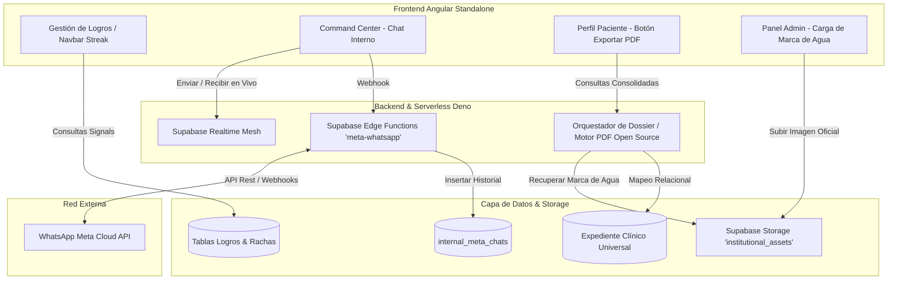
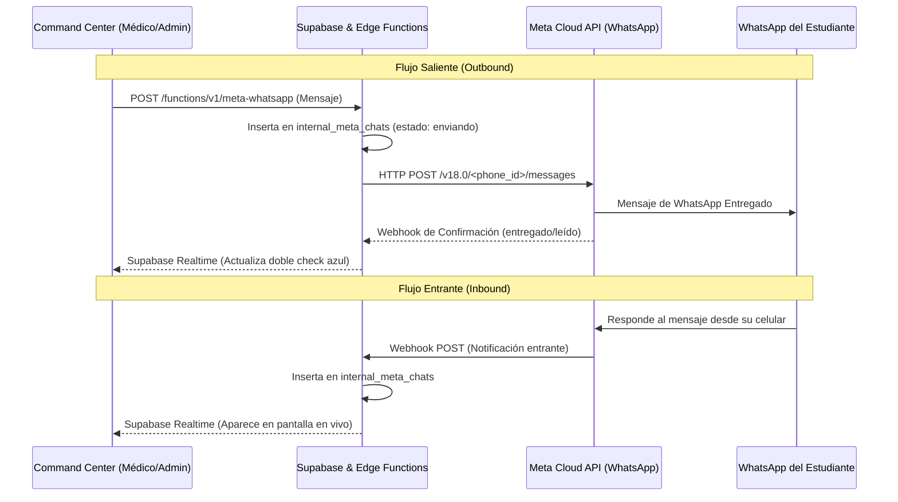
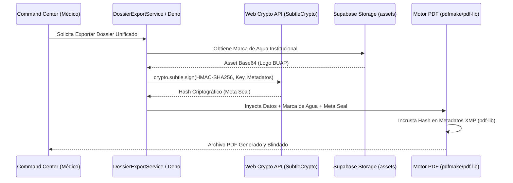

# Documento de Diseño de Sistema (SDD) - Nuevas Epicas
**Ecosistema de Asistencia Emocional BUAP**
**Metodología: Spect Kit SDD (Spec-Driven Development)**

---

## 1. Visión General de la Arquitectura

Este documento define las especificaciones técnicas y los lineamientos arquitectónicos para la implementación de tres grandes pilares funcionales en el ecosistema:
1. **Skill 10: Sistema de Logros y Gamificación (Incentivación estilo Duolingo).**
2. **Skill 11: Sistema de Chat Interno conectado bidireccionalmente con Meta Cloud API (WhatsApp).**
3. **Skill 12: Exportación Masiva del Expediente Clínico con Marca de Agua Institucional y Meta Seal Criptográfico.**



---

## 2. Especificación Arquitectónica por Épica

### 2.1. Skill 10: Sistema de Logros y Gamificación (Duolingo Style)

#### 2.1.1. Modelo de Datos Relacional (PostgreSQL)
```sql
CREATE TABLE public.achievement_categories (
    id UUID PRIMARY KEY DEFAULT gen_random_uuid(),
    name TEXT NOT NULL,
    description TEXT,
    icon_name TEXT NOT NULL
);

CREATE TABLE public.achievements (
    id UUID PRIMARY KEY DEFAULT gen_random_uuid(),
    category_id UUID REFERENCES public.achievement_categories(id),
    title TEXT NOT NULL,
    description TEXT NOT NULL,
    xp_value INTEGER DEFAULT 10,
    badge_image_url TEXT,
    requirement_type TEXT NOT NULL, -- 'streak', 'sessions_completed', 'custom_clinical'
    requirement_value INTEGER NOT NULL,
    creator_role INTEGER NOT NULL, -- 1: Admin, 3: Psicólogo, 4: Nutriólogo
    creator_id UUID REFERENCES public.users(id),
    created_at TIMESTAMP WITH TIME ZONE DEFAULT timezone('utc'::text, now())
);

CREATE TABLE public.user_achievements (
    id UUID PRIMARY KEY DEFAULT gen_random_uuid(),
    user_id UUID REFERENCES public.users(id) ON DELETE CASCADE,
    achievement_id UUID REFERENCES public.achievements(id) ON DELETE CASCADE,
    unlocked_at TIMESTAMP WITH TIME ZONE DEFAULT timezone('utc'::text, now()),
    UNIQUE(user_id, achievement_id)
);

CREATE TABLE public.user_streaks (
    user_id UUID PRIMARY KEY REFERENCES public.users(id) ON DELETE CASCADE,
    current_streak INTEGER DEFAULT 0,
    best_streak INTEGER DEFAULT 0,
    last_activity_date DATE DEFAULT CURRENT_DATE,
    total_xp INTEGER DEFAULT 0
);
```

#### 2.1.2. Políticas de Seguridad (RLS)
- `achievements`: Lectura pública para usuarios autenticados. Escritura exclusiva para Administradores (`role = 1`) y Personal de la Salud (`role IN (3,4)`).
- `user_achievements` & `user_streaks`: Lectura para el propio alumno y sus clínicos asignados.

#### 2.1.3. Motor de Rachas (*Streak Engine*)
- Cada vez que el estudiante guarda una entrada en **Mi Diario**, registra una comida en **NutriMind** o completa un chat con **Amati IA**, el servicio de Angular dispara una actualización a `user_streaks`.
- Si `last_activity_date == CURRENT_DATE - 1`, `current_streak` se incrementa en 1.
- Si `last_activity_date < CURRENT_DATE - 1`, la racha se reinicia (`current_streak = 1`).

---

### 2.2. Skill 11: Chat Interno Conectado con Meta Cloud API (WhatsApp)

#### 2.2.1. Flujo Bidireccional
La arquitectura garantiza que los especialistas clínicos y administrativos puedan enviar mensajes de WhatsApp sin utilizar sus dispositivos móviles personales ni exponer sus números de teléfono.



#### 2.2.2. Tabla de Seguimiento
```sql
CREATE TABLE public.internal_meta_chats (
    id UUID PRIMARY KEY DEFAULT gen_random_uuid(),
    student_id UUID REFERENCES public.users(id) NOT NULL,
    sender_id UUID REFERENCES public.users(id), -- NULL si el remitente es el alumno vía WhatsApp
    message_body TEXT NOT NULL,
    whatsapp_message_id TEXT, -- ID de rastreo de Meta
    delivery_status TEXT DEFAULT 'sent', -- 'sent', 'delivered', 'read', 'received'
    created_at TIMESTAMP WITH TIME ZONE DEFAULT timezone('utc'::text, now())
);
```

---

### 2.3. Skill 12: Dossier Clínico Unificado, Marca de Agua y Meta Seal (Exportación Masiva PDF)

#### 2.3.1. Arquitectura Estricta de Código Abierto (Strict Open Source Requirement)
Para garantizar la soberanía tecnológica, evitar costos de licencias comerciales y asegurar la máxima flexibilidad en el cumplimiento de normativas de salud (HIPAA / NOM-024), todo el pipeline de generación de PDF operará exclusivamente con librerías y estándares de código abierto:
- **Motor de Renderizado PDF:** `pdfmake` (MIT License) para la definición estructurada del árbol de documentos y `pdf-lib` (MIT License) para la manipulación y firma de metadatos binarios.
- **Motor Criptográfico:** `Web Crypto API` (`window.crypto.subtle` en navegadores / `crypto` nativo en Deno) para el cálculo de hashes HMAC-SHA256 sin depender de librerías cerradas.
- **Renderizado Gráfico:** Renderizado nativo HTML5 Canvas (`Chart.js` / `html2canvas`) para integrar gráficos de evolución del estado de ánimo y peso en Base64.

#### 2.3.2. Carga de Marca de Agua Institucional por el Administrador
1. **Panel de Gestión Admin (`features/admin/settings` - Skill 8):** El Administrador dispone de un formulario dedicado para cargar el logotipo oficial y marca de agua institucional de la BUAP o centro clínico.
2. **Almacenamiento Protegido:** La imagen se sube de forma segura al bucket de Supabase Storage `institutional_assets`.
3. **Inyección Estructural en el PDF:** Al generar el Dossier, el orquestador recupera dinámicamente este activo oficial y lo inyecta en dos niveles:
   - **Membrete Oficial:** Cabecera superior izquierda en todas las páginas formales.
   - **Marca de Agua Diagonal:** Renderizado de fondo en formato diagonal centellante con una opacidad calculada del 12% (`opacity: 0.12`), previniendo la duplicación no autorizada del documento.

#### 2.3.3. Meta Seal (Sello Criptográfico de Metadatos y No Repudio)
El **Meta Seal** representa un mecanismo criptográfico inviolable diseñado para certificar la integridad, fecha exacta y autoría de la descarga del expediente, dando cumplimiento al principio de **No Repudio (NOM-024)**.



- **Fórmula Criptográfica del Meta Seal:**
  ```typescript
  // Algoritmo de Generación del Meta Seal mediante Web Crypto API
  const metaPayload = `${profesional.matricula}:${paciente.id}:${triage.urgencyScore}:${new Date().toISOString()}`;
  const enc = new TextEncoder();
  const key = await window.crypto.subtle.importKey(
    'raw', enc.encode(environment.dossierSecretKey),
    { name: 'HMAC', hash: 'SHA-256' }, false, ['sign']
  );
  const signature = await window.crypto.subtle.sign('HMAC', key, enc.encode(metaPayload));
  const metaSealHash = Array.from(new Uint8Array(signature))
    .map(b => b.toString(16).padStart(2, '0')).join('');
  ```
- **Visibilidad Dual:**
  - **Meta Seal Visible:** Aparece impreso en la primera página (Resumen Ejecutivo) bajo una caja visual de certificación: `[✓ Sello Criptográfico de No Repudio: <hash>]`.
  - **Meta Seal Invisible:** Se graba permanentemente dentro de las propiedades binarias del archivo PDF (`Document Info` / `Custom Metadata` en `pdf-lib`), haciendo imposible alterar el documento sin que el hash pierda coincidencia.

---

## 3. Sincronización del Ecosistema
Al finalizar el desarrollo o actualización de cada épica, se deberá ejecutar obligatoriamente el comando:
```bash
graphify update .
```
Para asegurar que el grafo de conocimiento refleje los nuevos nodos de código, el flujo criptográfico del Meta Seal y las marcas de agua de inmediato.
